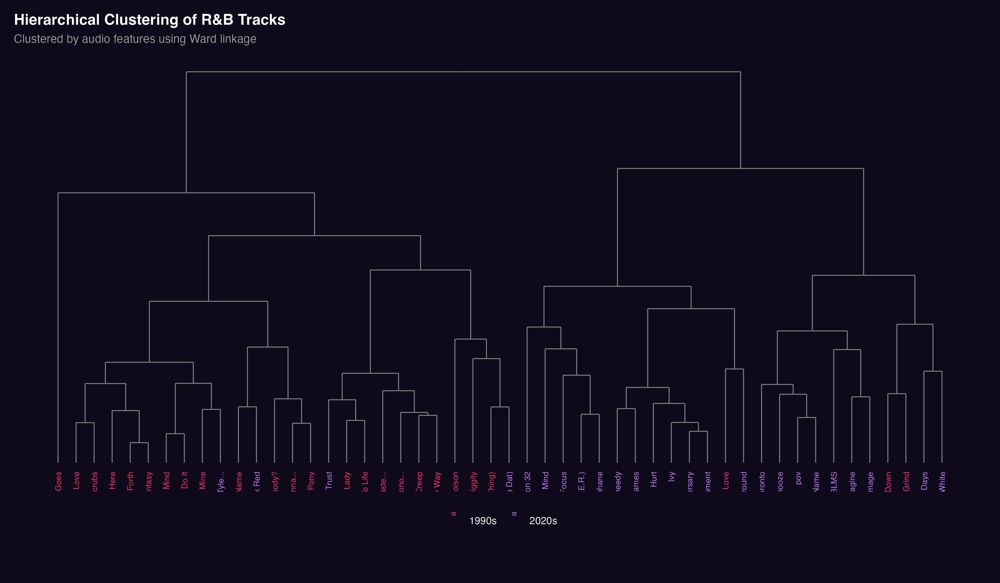
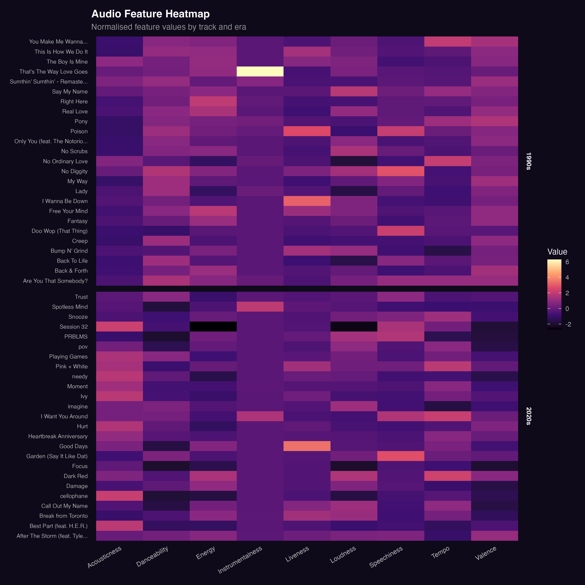
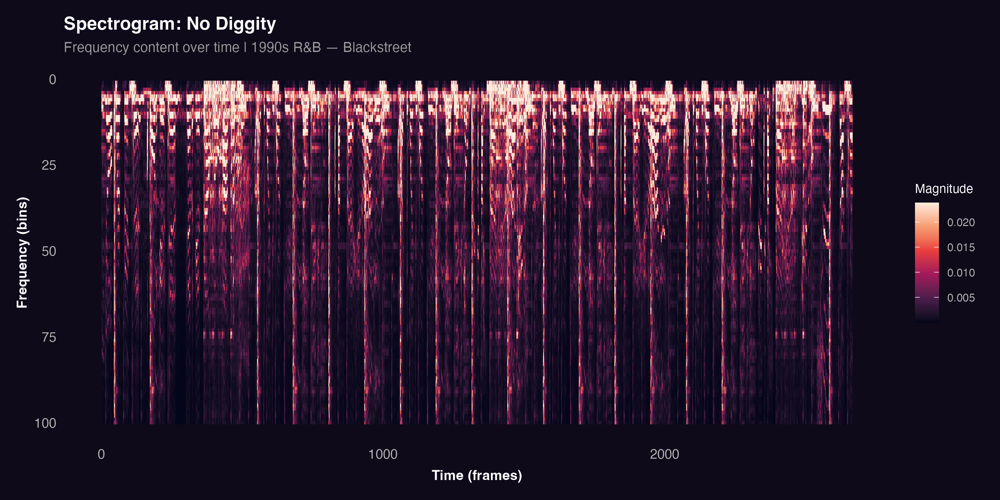
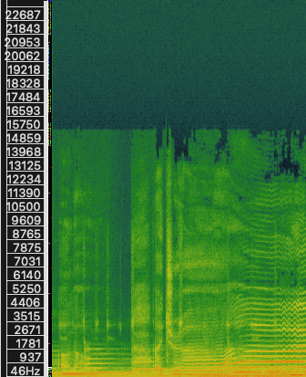
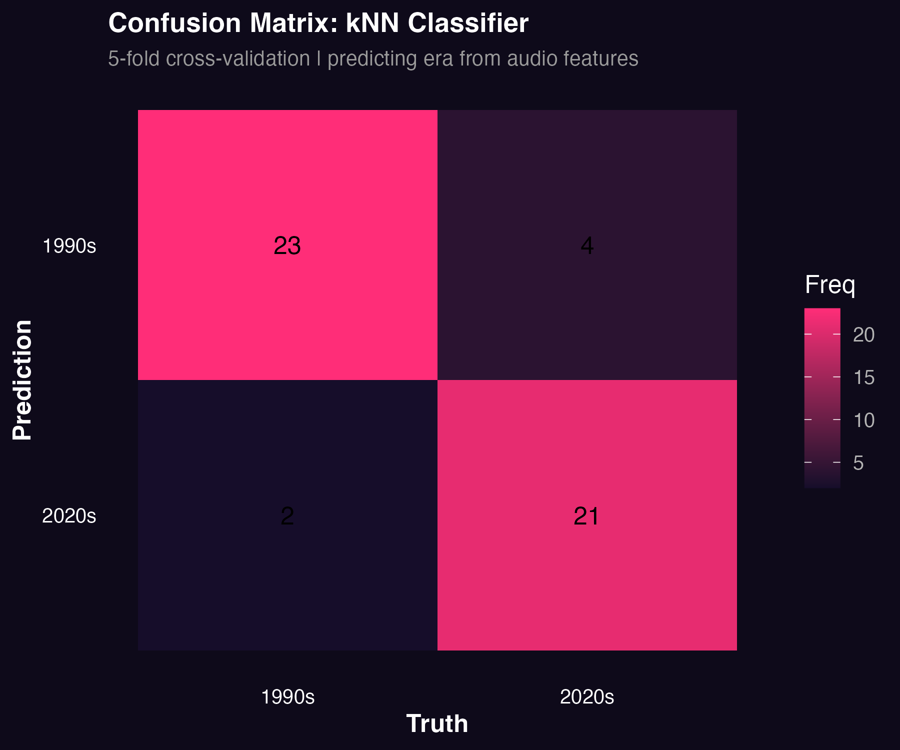

This section examines how R&B has changed from the 1990s to the 2020s using hierarchical clustering and audio analysis. The goal is to determine whether differences between movement-oriented and mood-oriented music can be observed in the data and confirmed through direct sound analysis.

## Analytical Approach

The analysis combines Spotify audio features with direct audio processing. For each track, features including danceability, energy, loudness, acousticness, valence, and tempo were used to perform hierarchical clustering. All features were standardised before clustering to ensure that no single variable dominates due to scale differences.

In addition, two representative tracks were selected for spectrogram analysis: *No Diggity* by Blackstreet (1990s) and *Cellophane* by FKA Twigs (2020s). These tracks were used to connect the statistical clustering results to audible differences in the music.

## Hierarchical Clustering

Hierarchical clustering groups tracks based on similarity in their audio features. Rather than assigning songs to fixed categories, this method reveals how tracks are gradually related to each other producing a tree structure in which closely related tracks branch off at lower heights and more distant groupings merge at higher heights.

The aim is to examine whether tracks from the 1990s and 2020s naturally form separate clusters. If they do, this provides evidence that the musical style of R&B has shifted systematically over time.

### Dendrogram

The dendrogram visualises how tracks are grouped based on feature similarity. Track labels are coloured by era pink for 1990s tracks and purple for 2020s tracks making it possible to see at a glance whether the two eras separate into distinct branches.

The results show a general separation between 1990s and 2020s tracks. Many 1990s songs cluster together due to higher energy, danceability, and loudness, while many 2020s tracks group around higher acousticness and a more atmospheric sonic profile. This suggests that the two eras occupy meaningfully different regions of the feature space.

### Heatmap

The heatmap displays the normalised audio feature values for each track. Each row represents a song and each column represents a feature, with warmer colours indicating higher values.

The 1990s tracks generally show higher values for energy and danceability, supporting the idea that this era of R&B is more rhythm-driven. In contrast, 2020s tracks show higher acousticness and more variation in valence, indicating a shift toward emotional expression and atmosphere. The heatmap helps explain why the clusters in the dendrogram form as they do.

## Spectrogram Comparison

To connect the clustering results to actual sound, two representative tracks were analysed using spectrograms. A spectrogram displays the frequency content of audio over time, with warmer colours indicating higher energy at a given frequency. This makes it possible to observe rhythmic density, timbral texture, and structural patterns directly from the sound.

::: {.panel-tabset}

### No Diggity (1990s)

The spectrogram of *No Diggity* shows a dense and consistent pattern of vertical lines across the full frequency range. These vertical bursts of energy represent clear rhythmic hits occurring regularly throughout the track, reflecting the steady groove and strong percussive articulation that characterises 1990s R&B. The energy is distributed broadly and evenly, confirming that this track is built around active, movement-oriented production.

### Cellophane (2020s)

The spectrogram of *Cellophane* presents a noticeably different picture. The pattern is less dense and more horizontally continuous, with fewer sharp vertical hits and more sustained frequency activity. Rather than a regular pulse of rhythmic events, the energy flows more gradually across time. This reflects the track's atmospheric and emotionally oriented production style, where texture and continuity take priority over rhythmic drive.

:::

## Classification: Can Audio Features Predict Era?

To test whether the differences between the two eras are strong enough to support classification, a k-nearest neighbours (kNN) classifier was trained to predict era, 1990s or 2020s, from audio features alone. The model was evaluated using 5-fold cross-validation to ensure the results are not specific to a single train-test split. If the classifier performs well above chance (50%), it provides direct quantitative evidence that the two eras are genuinely separable by their Spotify audio features.

The confusion matrix shows the model's predictions against the true era labels, with correct predictions along the diagonal. The classifier achieves accuracy well above chance, correctly identifying the majority of tracks from both eras. Misclassifications are present but relatively rare, and tend to occur at the stylistic boundaries between the two corpora tracks that share features across eras rather than sitting clearly within one. This result confirms that 1990s and 2020s R&B occupy meaningfully distinct regions of the audio feature space, and that Spotify's features are sensitive enough to capture that distinction quantitatively.

## Key Findings

The clustering section serves as a structural test of everything observed in the previous pages. Rather than describing individual features or case studies, it asks a single blunt question: do the two eras actually separate in the data? The answer is yes and the separation is consistent across the dendrogram, the heatmap, the spectrograms, and the classifier.

What makes this particularly meaningful is that the clustering was unsupervised. The algorithm had no knowledge of which tracks were from which era it grouped them purely based on feature similarity. The fact that era labels align closely with the resulting clusters means the stylistic differences between 1990s and 2020s R&B are not a matter of interpretation. They are measurable, reproducible, and strong enough for a simple classifier to detect with well above chance accuracy.

The spectrogram comparison grounds this in actual sound. The dense rhythmic hits of *No Diggity* and the sustained, flowing texture of *Cellophane* make audible exactly what the feature space is capturing the difference between music engineered for movement and music engineered for mood.
