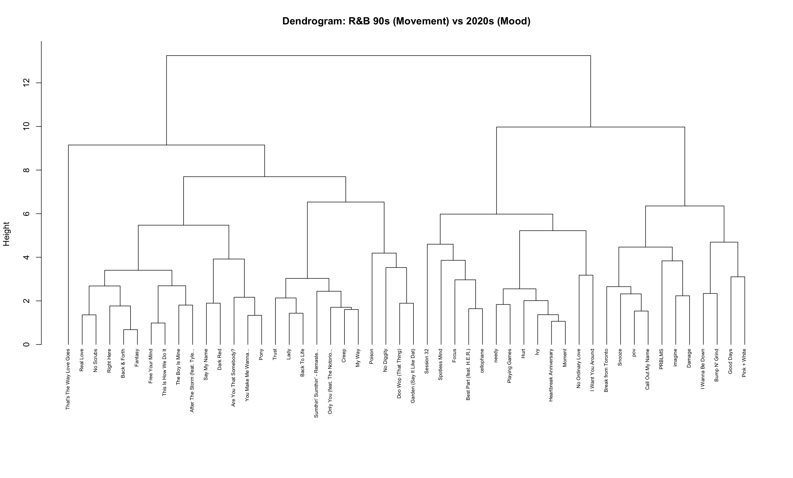
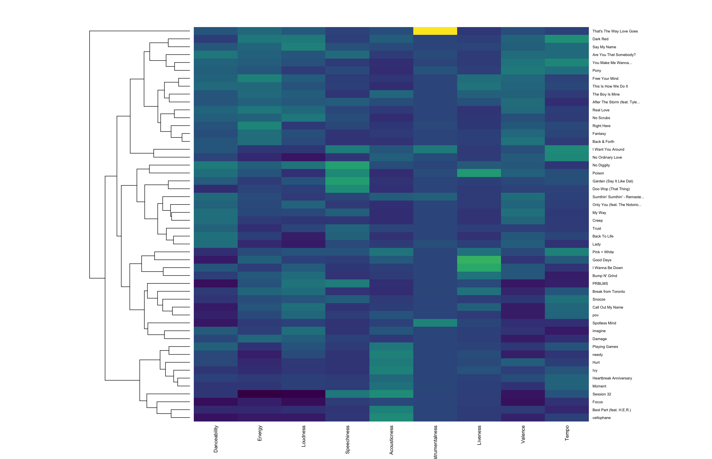
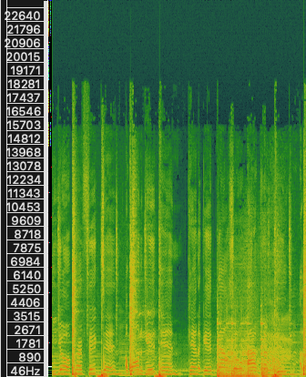

This section examines how R&B has changed from the 1990s to the 2020s using both statistical clustering and audio analysis. The goal is to see whether differences between “movement” and “mood” can be observed in both data and sound.

## Analytical Workflow

The analysis combines Spotify audio features with direct audio processing.

First, playlists of 1990s and 2020s R&B tracks were collected. For each track, Spotify features such as **danceability**, **energy**, **loudness**, **acousticness**, **valence**, and **tempo** were used. These features were then used to perform hierarchical clustering.

In addition, two representative tracks were selected: *No Diggity* (1990s) and *Cellophane* (2020s). These tracks were used to link the statistical results to the actual sound of the music.

The audio files were first obtained as **MP3** and then converted to **WAV** format to preserve sound quality. Short excerpts were edited in **Audacity** to focus on comparable sections. These excerpts were then analyzed in **Sonic Visualiser**, where spectrograms were used to examine frequency content and rhythmic structure.

This combined approach makes it possible to connect numerical features to audible differences.

## Hierarchical Clustering

Hierarchical clustering groups songs based on similarity in their audio features. Instead of assigning songs to fixed categories, this method shows how tracks are gradually related to each other.

The aim is to see whether songs from the 1990s and 2020s naturally form separate clusters. If they do, this suggests that the musical style of R&B has changed over time.

## Dendrogram

The dendrogram shows how songs are grouped based on similarity. The vertical axis (*Height*) represents the distance between clusters.

The results show a general separation between 1990s and 2020s tracks. Many 1990s songs cluster together due to higher **energy**, **danceability**, and **loudness**. In contrast, many 2020s tracks are grouped around higher **acousticness** and a more atmospheric sound.

This suggests that 1990s R&B is more focused on rhythm and movement, while 2020s R&B is more focused on mood and texture.

[{width=85%}](Dendrogram.png)

## Heatmap

The heatmap shows the values of the audio features for each track. Each row represents a song, and each column represents a feature.

The 1990s tracks generally show higher values for **energy** and **danceability**. This supports the idea that this era of R&B is more rhythm-driven.

In contrast, 2020s tracks show higher **acousticness** and more variation in **valence**. This indicates a shift toward emotional expression and atmosphere.

The heatmap helps explain why the clusters in the dendrogram are formed.

[{width=85%}](Heatmap.png)

## Spectrogram Comparison

To connect the clustering results to actual sound, two representative tracks were analyzed using spectrograms.

### No Diggity (1990s)

The spectrogram of *No Diggity* shows strong vertical lines, which represent clear rhythmic hits. The pattern is dense and consistent, reflecting a steady groove.

This supports the idea that 1990s R&B is built around rhythm and movement.

[{width=55%}](Spectogram_Nodiggity.png)

### Cellophane (2020s)

The spectrogram of *Cellophane* is more spread out and less dense. There are fewer strong rhythmic patterns and more sustained sounds.

This reflects a more atmospheric and emotional style, which is typical of modern R&B.

[{width=55%}](Spectogram_Cellophane.png)

## Interpretation

The results from clustering and audio analysis point in the same direction.

1990s R&B is generally characterized by higher energy, stronger rhythm, and greater danceability. In contrast, 2020s R&B places more emphasis on acoustic elements, space, and emotional variation.

The spectrograms support this pattern by showing clearer rhythmic structure in the 1990s track and a more open, atmospheric structure in the 2020s track.

Overall, the findings suggest that R&B has shifted from a movement-focused style to a mood-focused style.

## Conclusion

The clustering analysis shows that many 1990s and 2020s tracks group differently based on their audio features. The heatmap explains these differences, and the spectrograms confirm them at the level of sound.

Together, these results suggest that R&B has evolved over time. While 1990s R&B is more focused on rhythm and dance, modern R&B emphasizes mood, texture, and emotional expression.