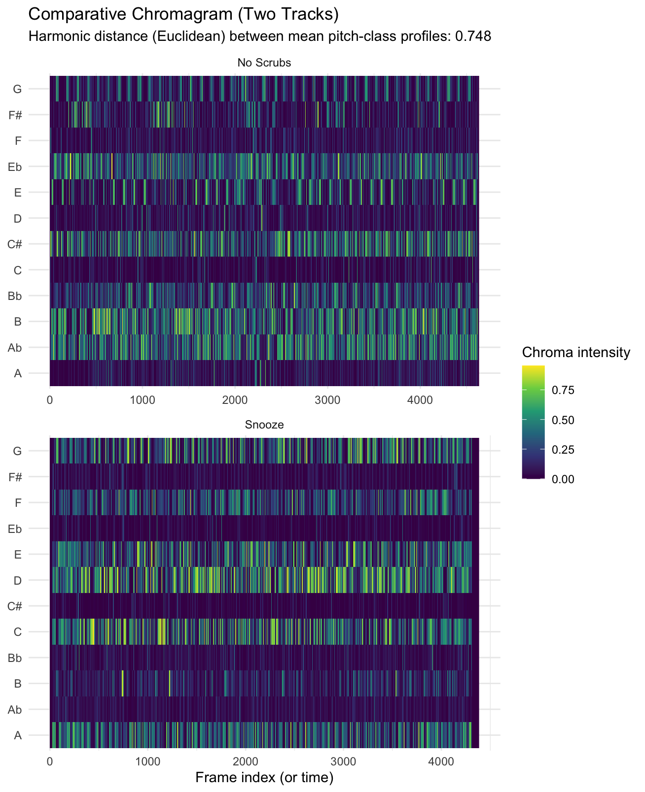
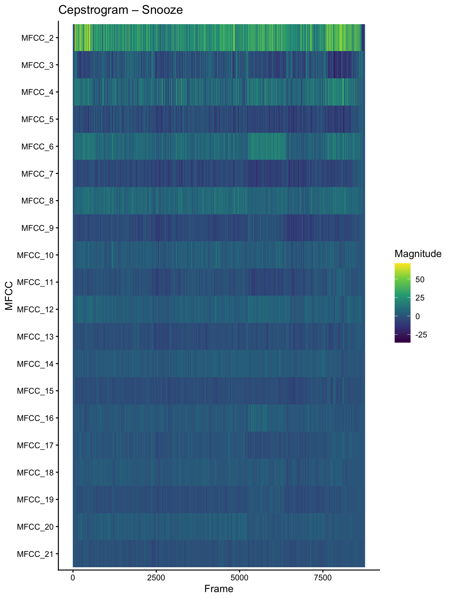
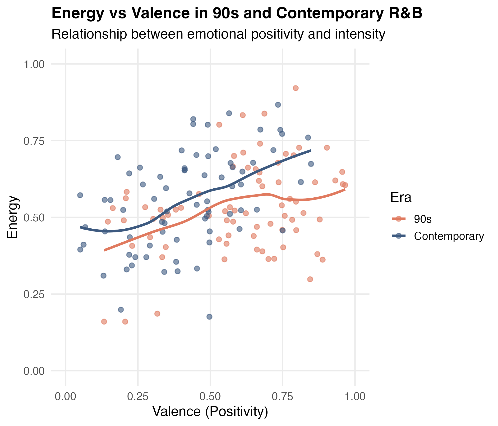
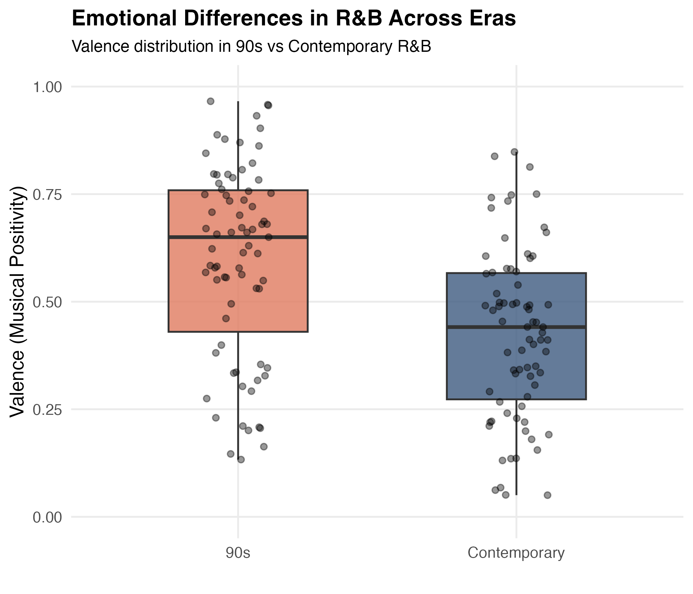
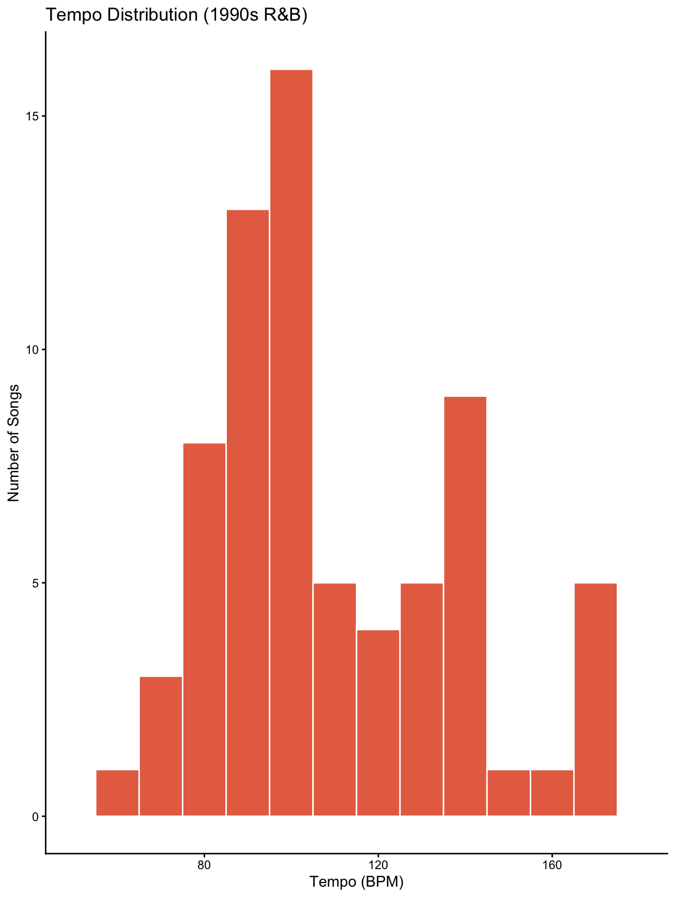
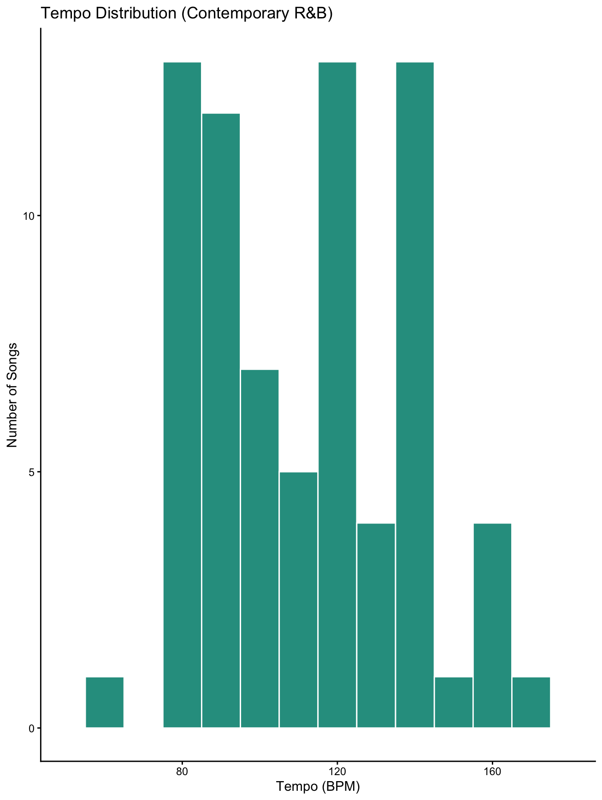

# Overview

::: card
This dashboard explores musical characteristics of R&B songs using computational analysis.\
The goal is to compare harmonic structure, timbre, and emotional features between tracks and between different eras of R&B.

The visualizations help reveal patterns in pitch usage, sound texture, and emotional expression that may not be obvious from listening alone.
:::

# Harmonic Structure

## Chromagram Comparison

::: card
{fig-align="center"}

The chromagram compares the pitch-class activity of the songs **No Scrubs** and **Snooze**. Each horizontal row represents one of the twelve pitch classes (A–G), while the color intensity indicates how strongly that pitch appears in the audio signal over time.

Both tracks show repeated emphasis on a limited number of pitch classes, reflecting chord progressions typical of R&B music.

However, the distribution of pitch activity differs slightly between the songs. **No Scrubs** appears to maintain more consistent harmonic repetition, while **Snooze** shows more variation in pitch intensity over time.

The Euclidean harmonic distance between the mean pitch-class profiles of the two songs is **0.748**, indicating a moderate harmonic difference.
:::

# Timbre Analysis

## Cepstrogram – Snooze

::: card
{fig-align="center" width="80%"}

This cepstrogram visualizes the timbral characteristics of the song **Snooze** using **Mel-Frequency Cepstral Coefficients (MFCCs)**.

Each horizontal band represents a different MFCC coefficient capturing aspects of the sound’s spectral shape.

Lower coefficients tend to show more variation, reflecting changes in vocal presence and instrumentation across the track.

The gradual color changes suggest smooth transitions between sections rather than abrupt timbral shifts.Conclusion
:::

# Emotional Characteristics

::: panel-tabset
## Energy vs Valence

{fig-align="center" width="70%"}

This scatterplot shows the relationship between energy (musical intensity) and valence (emotional positivity) for songs from two eras: the 1990s and contemporary R&B.

The upward trend in both groups suggests that songs with higher emotional positivity tend to also have higher energy levels.

## Valence Distribution

{fig-align="center" width="70%"}

This boxplot compares the distribution of valence between the two eras of R&B music.

Valence represents how positive or happy a song sounds on a scale from 0 to 1.

The median valence for 1990s tracks appears higher than for contemporary songs.
:::

::: card
The computational analysis reveals several interesting differences between the songs and eras examined.

The **chromagram** highlights moderate harmonic differences between *No Scrubs* and *Snooze*, while the **cepstrogram** shows that *Snooze* maintains relatively consistent timbral characteristics throughout the track.

The emotional feature analysis suggests that **contemporary R&B tends to have slightly lower energy and valence compared to 1990s R&B**, indicating a stylistic shift toward smoother and more reflective musical moods.

Together, these visualizations demonstrate how **data-driven analysis can reveal patterns in harmony, timbre, and emotional expression in popular music**.
:::

# Tempo Analysis

::: card
### Tempo Distribution Across R&B Eras

Tempo is an important rhythmic characteristic that influences the overall feel and groove of a song.\
To explore rhythmic differences between eras, the distributions of tempo values (in BPM) were compared for **1990s R&B** and **contemporary R&B** tracks.
:::

::::: {.columns .justify-content-center}
::: {.column width="35%"}
{fig-align="center" width="100%"}

**1990s R&B**

The tempo distribution of 1990s R&B tracks shows a clear concentration between 90 and 110 BPM. This range is characteristic of the groove-based rhythmic feel commonly associated with R&B production during that decade, where steady mid-tempo rhythms supported vocal performance and smooth harmonic progressions.
:::

::: {.column width="35%"}
{fig-align="center" width="100%"}

**Contemporary R&B**

In contrast, contemporary R&B displays a slightly broader tempo distribution. While many tracks still fall within the mid-tempo range, a noticeable number of songs appear at higher tempo values above 120 BPM, suggesting greater rhythmic diversity and experimentation in modern R&B production.
:::
:::::

::: card
### Interpretation

Overall, both eras favor mid-tempo grooves, which remain a defining rhythmic feature of R&B. However, the wider spread observed in contemporary tracks indicates that modern R&B artists and producers may be exploring a broader range of rhythmic styles, potentially reflecting influences from genres such as hip-hop, trap, and electronic music.
:::
