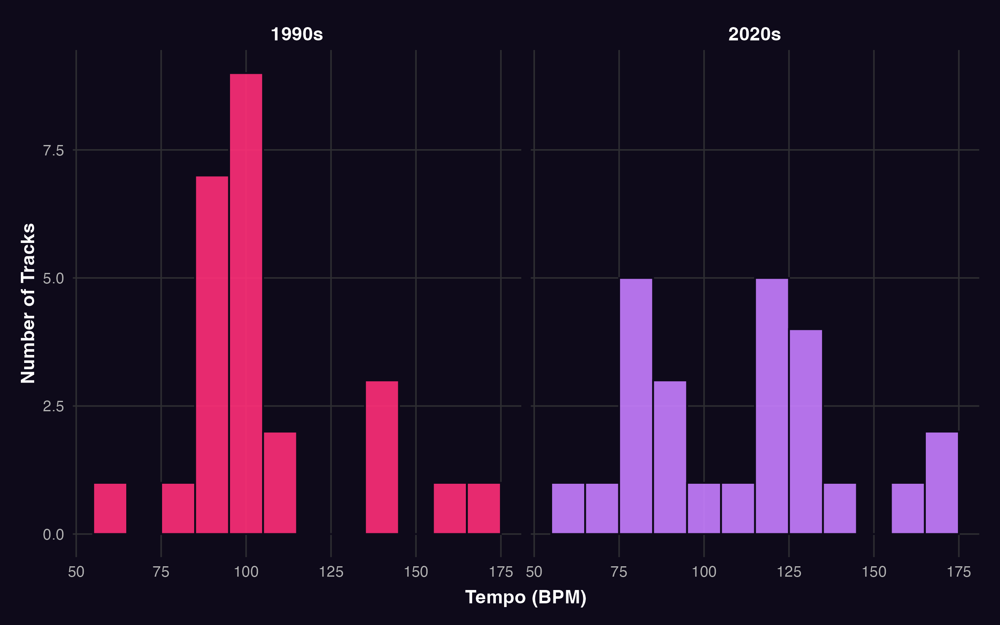
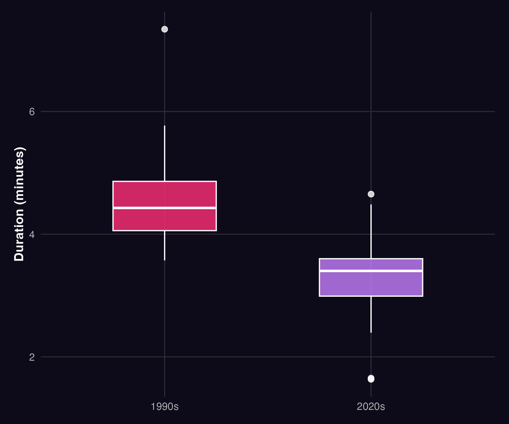
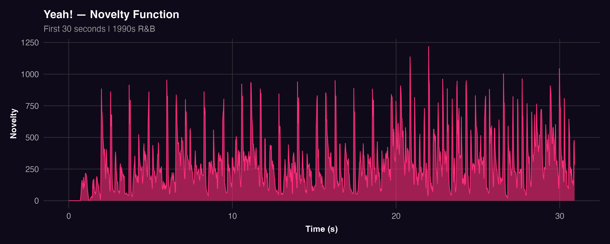
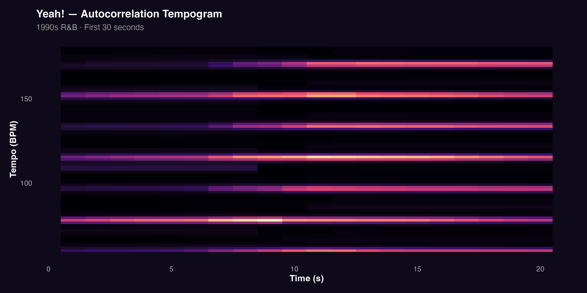
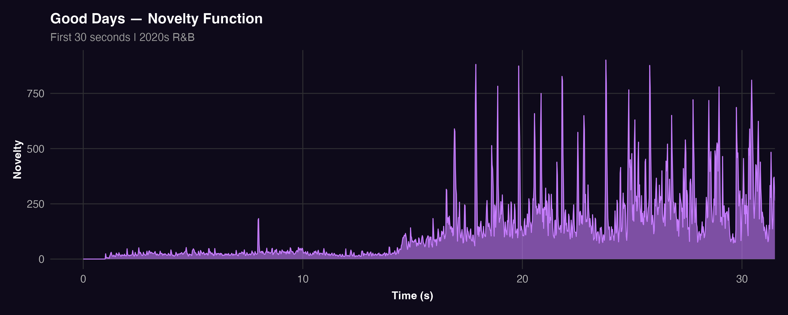
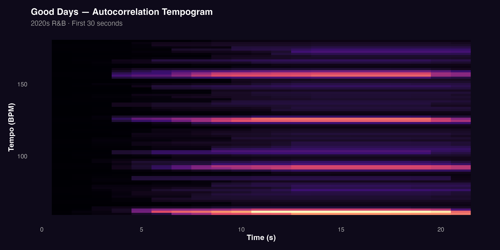

If R&B has shifted from movement to mood, that shift should be audible in its rhythmic structure. This section examines tempo, track duration, and pulse organisation to ask whether the rhythmic character of the genre has changed as markedly as its emotional and timbral qualities.

The analysis works at two levels. At the corpus level, histograms and boxplots capture broad tendencies in tempo and duration across all 50 tracks. At the track level, novelty functions and autocorrelation tempograms reveal how rhythmic activity and pulse stability unfold within individual songs offering a closer look at what groove-driven and atmosphere-oriented music actually looks like as audio data.

## Distribution of Tempo Across Eras

A histogram was used to examine the distribution of tempo values across the corpus, highlighting the most frequently occurring tempo ranges and allowing for a direct comparison between eras.

The 1990s corpus is concentrated within a relatively narrow mid-tempo range, particularly around 90–110 BPM a range closely associated with groove-based production and dancefloor energy. The 2020s corpus spreads more broadly across the tempo spectrum. Although mid-tempo tracks remain common, the wider distribution indicates less reliance on a single dominant rhythmic feel and greater openness to slower, more atmospheric pacing.

This difference is consistent with the idea that 1990s R&B was built around a shared rhythmic pulse, while contemporary R&B allows for more individual and varied listening experiences.

## Differences in Track Duration

Beyond tempo, track duration offers another window into how musical time is organised. Longer tracks create space for extended groove development and repetition both central to dancefloor-oriented listening. Shorter, more compact tracks may reflect different priorities: atmosphere, concision, or the influence of streaming-era listening habits.

The boxplot shows that 1990s R&B tracks are generally longer, with a higher median duration and more instances of extended track lengths. The 2020s corpus skews shorter and more tightly structured. This aligns with the tempo findings: not only do contemporary tracks move at a less uniform rhythmic pace, they also give that pace less time to establish itself.

## Temporal Dynamics at the Track Level

To complement the corpus-level analysis, two tracks were examined in greater detail using novelty functions and autocorrelation tempograms. *Yeah!* by Usher was selected as a defining example of 1990s dancefloor R&B a track built entirely around rhythmic momentum from its opening seconds. *Good Days* by SZA was chosen as a contrast: a 2020s track that opens gradually and treats rhythm as texture rather than drive. Together, they illustrate how differently the two eras deploy pulse and rhythmic energy.

### Yeah! by Usher (1990s)

The novelty function for *Yeah!* shows a dense and highly active pattern across the first 30 seconds.

Frequent and pronounced peaks indicate a high level of rhythmic activity, suggesting that percussive events occur regularly and with strong articulation. This reflects an immediate emphasis on rhythmic energy and supports the track's dance-oriented character.

The tempogram further reinforces this interpretation.

Clear and persistent horizontal bands indicate a stable and well-defined pulse. Rhythmic energy is concentrated at consistent tempo levels, suggesting a strong metrical structure. Together, these features demonstrate that *Yeah!* is built around a regular and highly accessible groove, encouraging bodily movement and rhythmic entrainment.

### Good Days by SZA (2020s)

In contrast, the novelty function for *Good Days* presents a more gradual and restrained pattern.

The opening section shows lower levels of activity, with fewer prominent peaks. Rather than emphasising immediate rhythmic impact, the track develops more slowly, allowing rhythmic intensity to emerge over time. This suggests a greater focus on atmosphere and timbral continuity.

The tempogram provides additional insight into this structure.

Although horizontal bands are still visible, they are less dominant and less tightly defined than in *Yeah!*. The pulse is present but does not strongly dictate the musical texture. Instead, rhythm functions more as a supportive element within a broader, more immersive sound environment.

Together, these features indicate that *Good Days* maintains temporal organisation while placing less emphasis on rhythmic drive. The result is a more introspective listening experience, in which pulse is less central to the overall musical expression.

## Key Findings

The temporal findings add a rhythmic dimension to what the earlier sections established through harmony, timbre, and emotional tone. Across all three measures tempo distribution, track duration, and pulse stability the same pattern holds: 1990s R&B is built around rhythmic consistency and sustained groove, while 2020s R&B is more varied, more compact, and less insistent about its own pulse.

What is notable here is that this is not simply a matter of being slower or quieter. *Good Days* is not an absence of rhythm it has a pulse, and it uses it. But that pulse functions differently: as atmosphere rather than engine. The contrast with *Yeah!* makes this audible. One track demands physical response from the first beat; the other invites emotional attention over time.

Together with the findings from the track-level, timbre, and clustering sections, the temporal analysis reinforces a consistent conclusion: R&B has shifted its centre of gravity from the body to the mind from music that moves you to music that stays with you.
