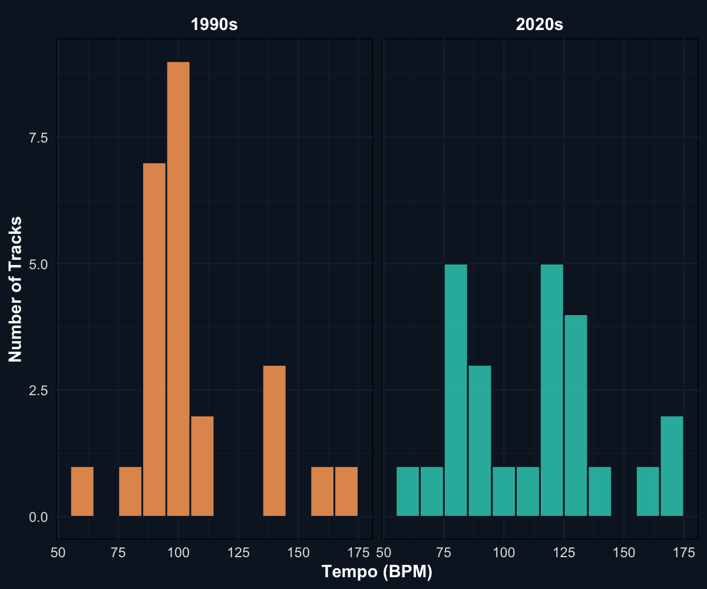
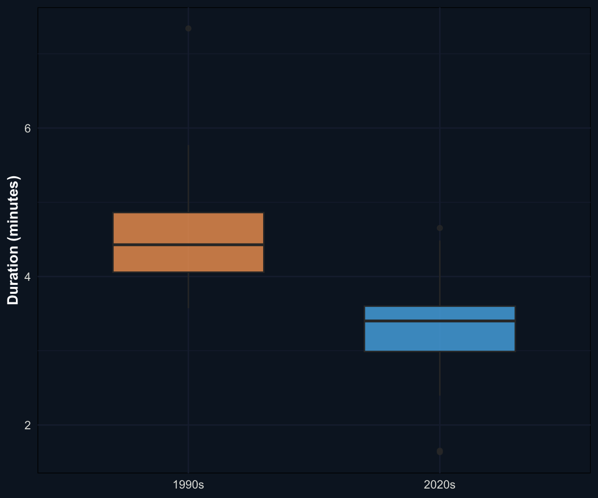
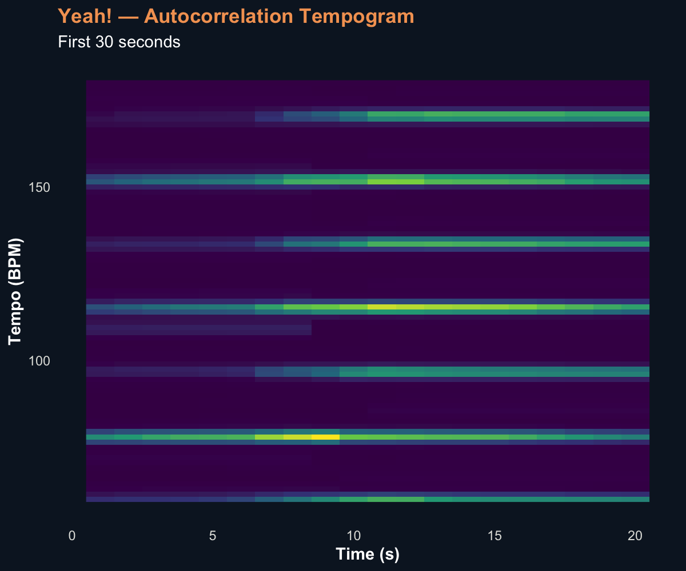
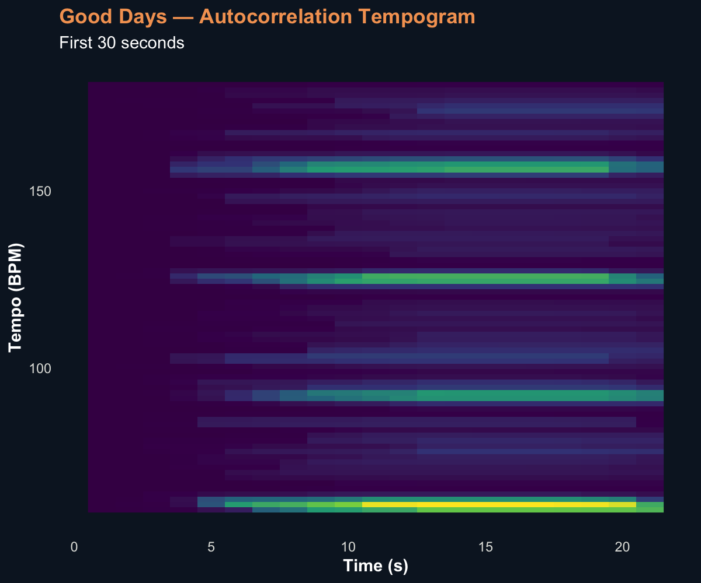

## Temporal Structure and Rhythmic Organisation in R&B

Temporal features were analysed to examine whether R&B has shifted from a movement-oriented style toward a more atmospheric and introspective one. This section combines corpus-level and track-level analyses to investigate rhythmic pacing, structural duration, and the organisation of pulse over time.

At the corpus level, tempo and duration provide a general overview of stylistic tendencies in 1990s and 2020s R&B. At the track level, novelty functions and autocorrelation tempograms offer a more detailed perspective on how rhythmic events and tempo-related patterns unfold within individual songs. Together, these approaches allow for a clearer comparison between groove-based and atmosphere-oriented musical characteristics.

### Analytical Approach to Temporal Features

Temporal features were examined using both statistical summaries and audio-based representations. Histograms and boxplots were used to capture overall trends in tempo and duration across the dataset, while novelty functions and tempograms were employed to analyse rhythmic activity and pulse stability within individual tracks.

### Distribution of Tempo Across Eras

A histogram was used to examine the distribution of tempo values across the corpus. This method highlights the most frequently occurring tempo ranges and allows for a direct comparison between the two eras.

The results show that 1990s R&B is concentrated within a relatively narrow mid-tempo range, particularly around 90–110 BPM. This suggests a stable rhythmic profile, consistent with groove-based production and music designed for physical movement. In contrast, 2020s R&B displays a broader distribution of tempo values. Although mid-tempo tracks remain common, the wider spread indicates greater rhythmic diversity and less reliance on a single dominant tempo range.

This difference supports the idea that earlier R&B prioritised danceability and bodily engagement, while contemporary R&B explores a wider range of expressive possibilities, including mood and atmosphere.

### Differences in Track Duration

Track duration was analysed using a boxplot to compare structural length across the two eras. Duration serves as an indicator of musical form, as longer tracks often allow for extended repetition and groove development, whereas shorter tracks tend to reflect more compact structures.

The boxplot shows that 1990s R&B tracks are generally longer than those from the 2020s. The median duration is higher, and the distribution suggests that extended track lengths were more common in earlier R&B. In contrast, 2020s tracks appear shorter and more tightly structured.

This pattern suggests a shift in how musical time is organised. Earlier R&B often relies on sustained grooves and repetition, supporting dance-oriented listening. Contemporary R&B, however, tends to favour more concise forms, which may reflect changes in listening habits, such as the influence of streaming platforms and a greater focus on atmosphere over prolonged rhythmic development.

### Temporal Dynamics at the Track Level

To complement the corpus-level analysis, two representative tracks were examined in greater detail: *Yeah!* by Usher and *Good Days* by SZA. These tracks illustrate contrasting approaches to rhythm and pulse organisation.

Novelty functions were used to capture moments of change in the audio signal, while autocorrelation tempograms were used to visualise the strength and stability of tempo over time. Together, these methods provide a detailed view of rhythmic activity within each track.

#### Yeah! – Usher: Rhythm and Tempo

The novelty function for *Yeah!* shows a dense and highly active pattern across the first 30 seconds.

Frequent and pronounced peaks indicate a high level of rhythmic activity, suggesting that percussive events occur regularly and with strong articulation. This reflects an immediate emphasis on rhythmic energy and supports the track’s dance-oriented character.

The tempogram further reinforces this interpretation.

Clear and persistent horizontal bands indicate a stable and well-defined pulse. Rhythmic energy is concentrated at consistent tempo levels, suggesting a strong metrical structure. Together, these features demonstrate that *Yeah!* is built around a regular and highly accessible groove, encouraging bodily movement and rhythmic entrainment.

#### Good Days – SZA: Rhythm and Tempo

In contrast, the novelty function for *Good Days* presents a more gradual and restrained pattern.

The opening section shows lower levels of activity, with fewer prominent peaks. Rather than emphasising immediate rhythmic impact, the track develops more slowly, allowing rhythmic intensity to emerge over time. This suggests a greater focus on atmosphere and timbral continuity.

The tempogram provides additional insight into this structure.

Although horizontal bands are still visible, they are less dominant and less tightly defined than in *Yeah!*. The pulse is present but does not strongly dictate the musical texture. Instead, rhythm functions more as a supportive element within a broader, more immersive sound environment.

Together, these features indicate that *Good Days* maintains temporal organisation while placing less emphasis on rhythmic drive. The result is a more introspective listening experience, in which pulse is less central to the overall musical expression.

## Key Findings

The temporal analyses reveal a clear shift in R&B across eras. At the corpus level, 1990s R&B is characterised by a concentrated tempo range and longer track durations, reflecting a strong emphasis on groove, repetition, and danceability. In contrast, 2020s R&B shows greater tempo variation and shorter track lengths, suggesting a move toward more flexible and compact structures.

At the track level, these differences become even more apparent. *Yeah!* demonstrates dense rhythmic activity and a stable pulse, both of which support movement and rhythmic engagement. *Good Days*, on the other hand, exhibits a more gradual rhythmic profile and a less dominant pulse structure, emphasising atmosphere and emotional depth.

Overall, the findings suggest that R&B has evolved from a predominantly groove-driven genre toward a more atmospheric and introspective style. While rhythm remains an important component, its role has shifted from driving physical movement to supporting mood and texture within the music.