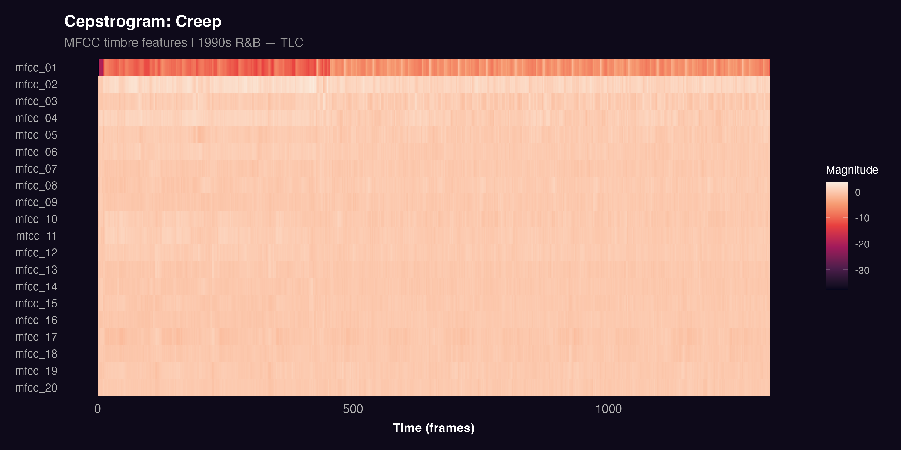
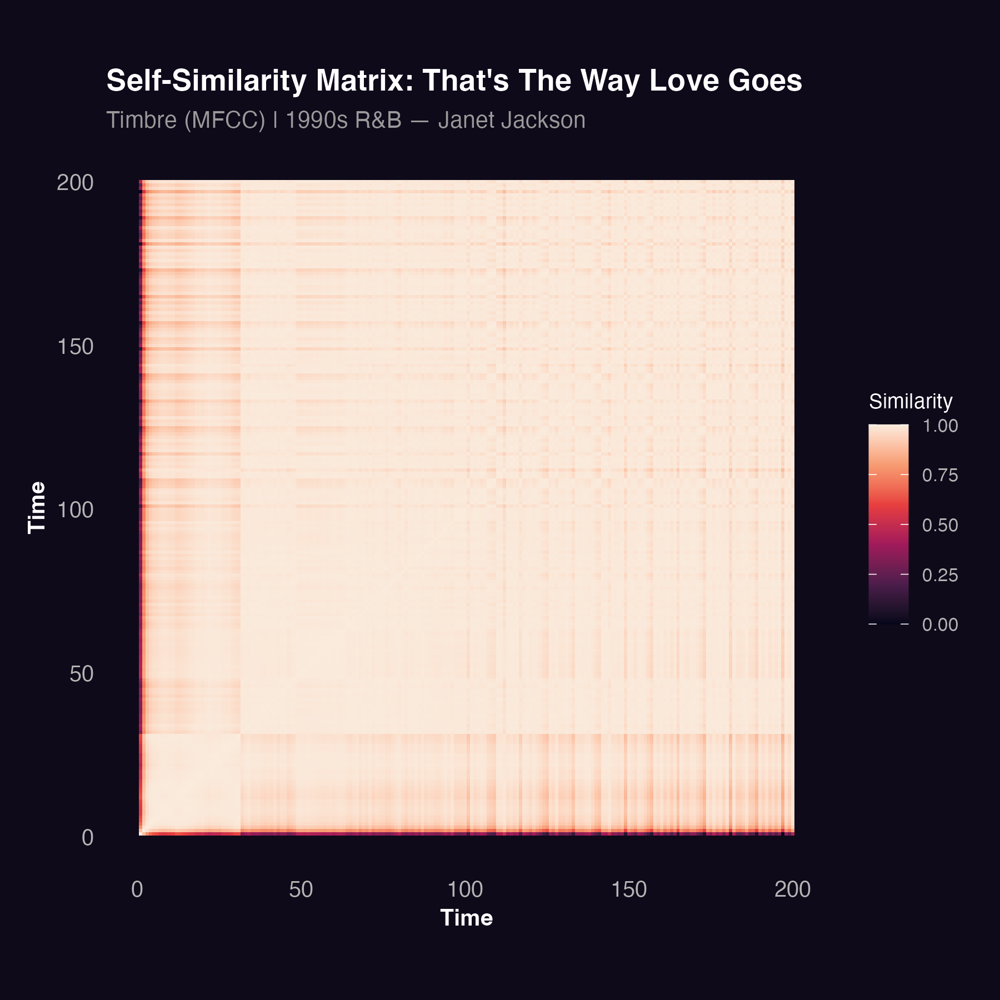
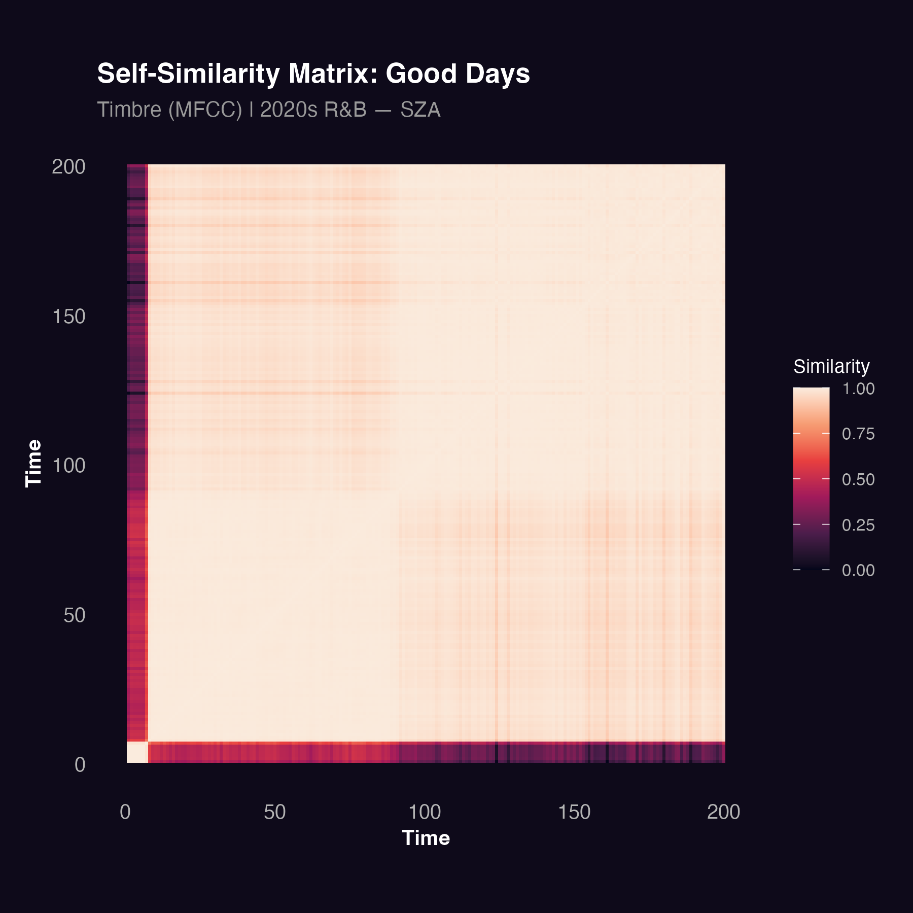
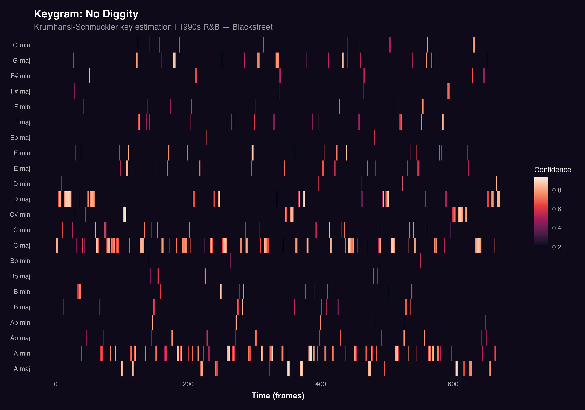
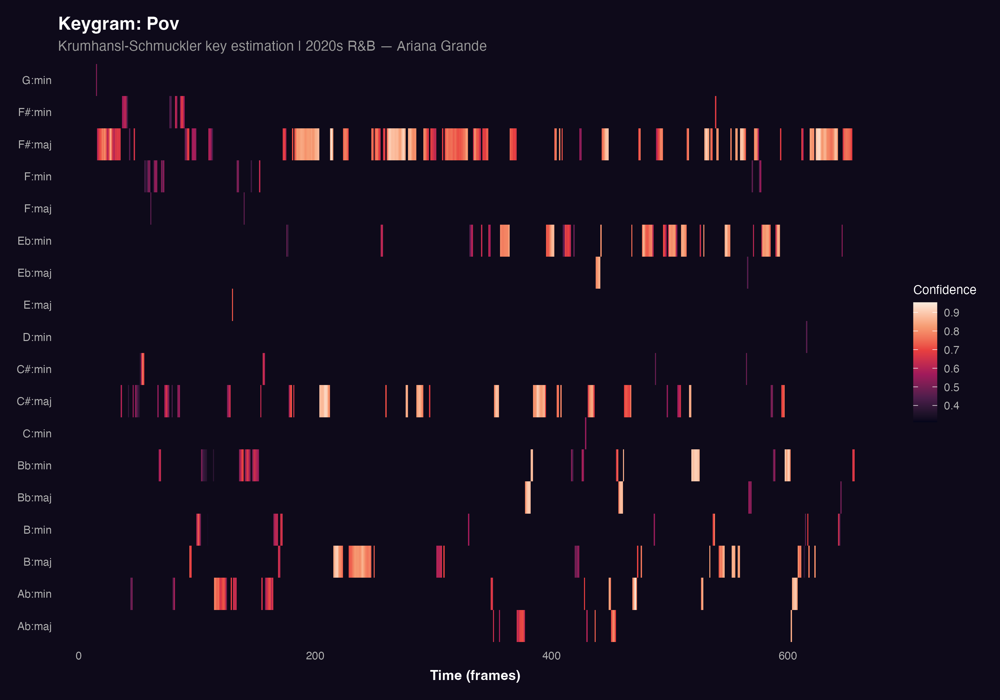

This section examines the timbral and harmonic character of R&B across eras. Timbre refers to the texture and colour of sound, capturing what makes a track feel dense or spacious, rough or smooth. Harmony refers to the choice of keys and chords, and whether a track stays in one tonal place or moves through different harmonic centres.

Together, these dimensions reveal how the sonic identity of R&B has changed beyond rhythm and energy.

## Timbral Texture

### Cepstrograms

Cepstrograms visualise Mel-Frequency Cepstral Coefficients (MFCCs) over time. MFCCs capture the timbral shape of sound by measuring how energy is distributed across frequency bands at each moment. Each row represents one MFCC coefficient and warmer colours indicate higher values. A track with rich, varied timbral content will show strong variation across rows, while a smoother, more uniform track will appear more even.

Two tracks were selected as case studies to illustrate timbral differences across eras: *Creep* by TLC, chosen for its layered 1990s production and strong rhythmic texture, and *Snooze* by SZA, chosen as a representative example of the softer, more minimalist sound typical of contemporary R&B.

### Creep by TLC (1990s)

The cepstrogram for *Creep* shows consistent activity across multiple MFCC coefficients throughout the track. The lower coefficients, which capture broad spectral shape, show strong and stable values, reflecting the track's layered production and steady rhythmic texture. The variation across coefficients is relatively dense, which is typical of tracks built around active instrumentation and a prominent rhythmic backbone.

### Snooze by SZA (2020s)

In contrast, *Snooze* shows a softer and more diffuse timbral profile. Activity is concentrated in fewer coefficients and the overall pattern is smoother and less varied. This reflects the track's minimalist production, with gentle layers, soft percussion, and a focus on vocal texture rather than rhythmic density. The cepstrogram is consistent with the idea that 2020s R&B tends toward a more restrained and atmospheric sonic palette — though it is worth noting that this is a single case study rather than a corpus-wide measurement.

## Structural Repetition

### Self-Similarity Matrices

A self-similarity matrix compares every moment in a track to every other moment based on timbral similarity. Bright squares along the diagonal indicate that a section sounds similar to itself over time, which is a sign of repetition and groove. Clear block structures away from the diagonal indicate recurring sections such as verses and choruses.

While cepstrograms reveal the texture of individual moments, self-similarity matrices reveal how a track is organised over time whether it is built around recurring grooves or evolves more freely. Two tracks were selected to compare structural repetition across eras: *That's The Way Love Goes* by Janet Jackson, a track widely associated with the loop-driven groove aesthetic of 1990s R&B, and *Good Days* by SZA, selected for its more continuous, evolving structure.

### That's The Way Love Goes by Janet Jackson (1990s)

The self-similarity matrix for *That's The Way Love Goes* shows clear block structures, with bright rectangular regions indicating repeated sections returning throughout the track. This is consistent with the groove-based, loop-oriented structure typical of 1990s R&B, where sections are revisited regularly to sustain rhythmic momentum and danceability.

### Good Days by SZA (2020s)

The matrix for *Good Days* is more diffuse. The diagonal is visible but weaker, and the off-diagonal block structure is less pronounced. This suggests a track that evolves more continuously, with fewer clearly repeated sections. The result is a more fluid and atmospheric structure less focused on repetition and groove, and more oriented toward gradual development and mood.

## Key and Chord Estimation

### Keygrams

A keygram estimates the most likely musical key at each moment in a track using the Krumhansl-Schmuckler algorithm, which compares the pitch class distribution to templates for all major and minor keys. Warmer colours indicate higher confidence in the estimated key. A track that stays in one key will show a clear, consistent band of warmth across the full timeline, while a harmonically mobile track will show shifting patterns.

The structural patterns observed in the self-similarity matrices raise a related question: does harmonic organisation follow the same divide? To explore this, two tracks were selected as keygram case studies *No Diggity* by Blackstreet, already identified as a harmonically stable, vamp-driven 1990s track, and *Pov* by Ariana Grande, selected for its more open and emotionally fluid harmonic character.

### No Diggity by Blackstreet (1990s)

The keygram for *No Diggity* shows a strong and consistent key estimate throughout the track. One key and its relative minor dominate the full timeline with high confidence, reflecting the track's tight harmonic vamp. The stability of the keygram mirrors what was observed in the chromagram: a track built around a small, repeating set of pitch centres with little harmonic movement.

### Pov by Ariana Grande (2020s)

The keygram for *Pov* shows a different pattern. While a primary key is still detectable, the confidence is lower and more variable across the track. Several competing keys show activity at different points, indicating a more harmonically open and ambiguous track. This reflects a compositional approach that prioritises emotional atmosphere over harmonic clarity, consistent with the broader shift toward introspection in 2020s R&B.

## Key Findings

What makes the findings of this section particularly compelling is not that any single dimension shows a difference — it is that all three point in the same direction. Timbre, structure, and harmony each tell a version of the same story: 1990s R&B was built around density, repetition, and tonal stability, while 2020s R&B leans toward restraint, fluidity, and harmonic openness.

This convergence matters because these are independent dimensions of musical organisation. The fact that timbral texture, formal structure, and key stability all shift together suggests that the change in R&B is not a surface-level production trend, but a deeper shift in how the music is composed and what it is designed to do. A track like *That's The Way Love Goes* is engineered for repetition its groove locks the listener in. A track like *Good Days* resists that lock, unfolding gradually and leaving more tonal space for emotional reflection.

These patterns align closely with what was observed in the track-level analysis, where valence and danceability showed the sharpest separation between eras. Taken together, the two sections build a consistent picture: R&B has shifted from music organised around movement and collective energy to music organised around mood, texture, and personal emotional experience. As with the track-level findings, these conclusions are based on a curated sample and individual case studies but the consistency across every dimension makes the pattern difficult to dismiss.
