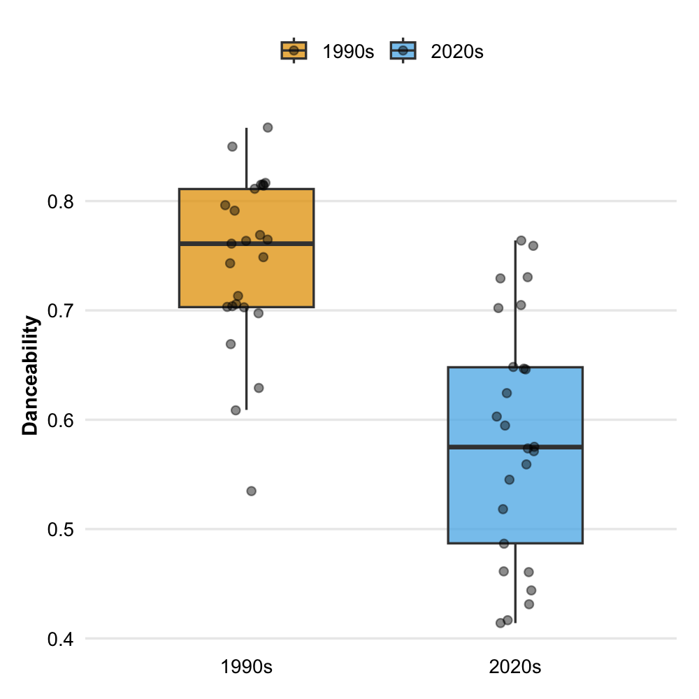
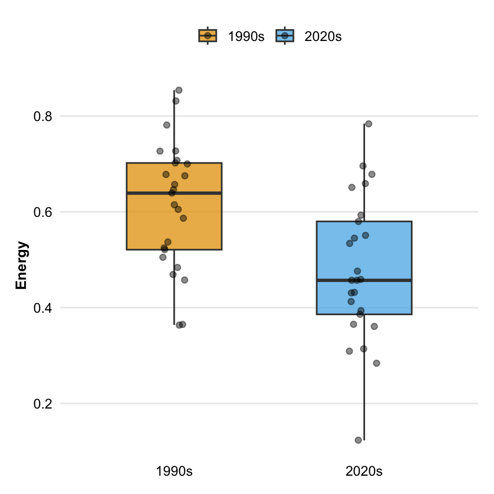
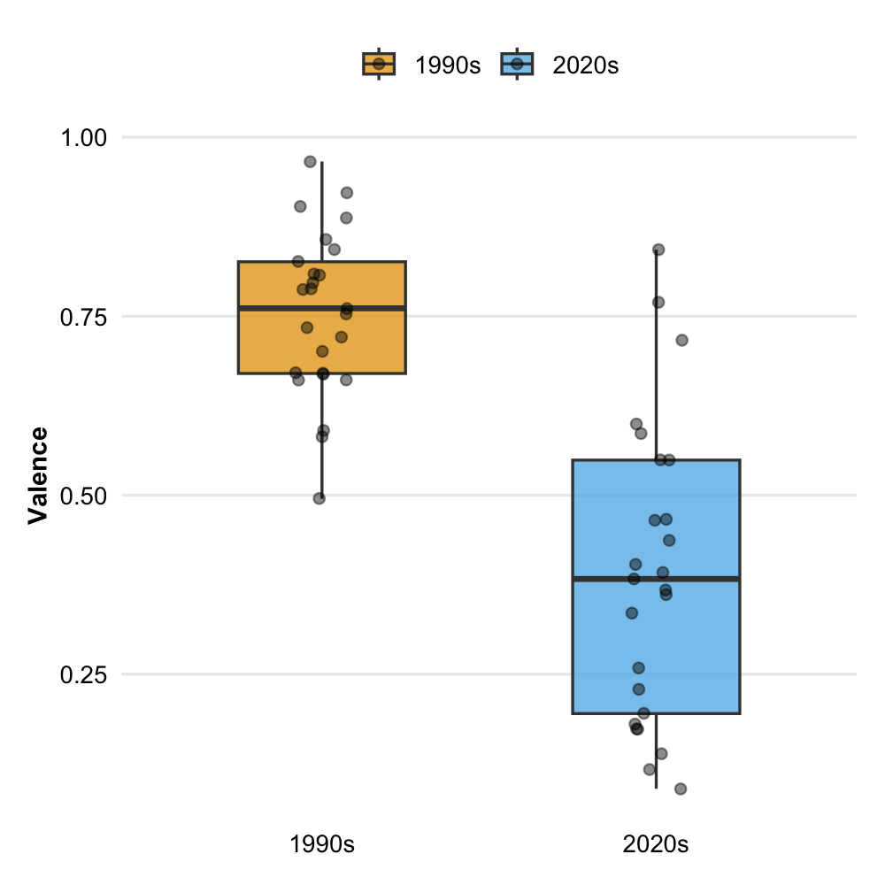

This section examines Spotify **track-level features** to evaluate whether measurable differences exist between 1990s and 2020s R&B. The analysis focuses on **danceability, energy, and valence**, which capture key aspects of rhythmic drive, intensity, and emotional expression.

To compare these features across the two corpora, boxplots are used as the primary visualization method. **Boxplots** allow for a clear comparison of distributions, highlighting differences in median values, variability, and the presence of outliers between eras. This makes them particularly suitable for identifying systematic shifts in musical characteristics.

In addition, **a** **scatterplot** is used to examine the relationship between danceability and energy, providing insight into how these features interact within and across the two time periods.

------------------------------------------------------------------------

## Danceability Across Eras

Danceability is one of the clearest indicators of the shift explored in this project. **The 1990s** corpus shows **higher danceability values** overall, supporting the idea that R&B in this period was more strongly associated with rhythmic drive and social movement. In **the** **2020s** corpus, **danceability values are generally** **lower**, suggesting a genre that has become less centered on dancing and more focused on mood and introspection.

------------------------------------------------------------------------

## Energy Across Eras

Energy reflects the intensity and activity level of a track. **The 1990s** corpus shows consistently **higher energy values**, indicating a stronger emphasis on rhythmic drive and musical momentum. In **the 2020s** corpus, **energy levels are generally lower**, suggesting a shift toward softer, less forceful production and a more relaxed listening experience.

------------------------------------------------------------------------

## Valence Across Eras

Valence captures the emotional positivity of a track. **The 1990s** corpus shows **higher valence values** overall, indicating a tendency toward more upbeat and outward emotional expression. In **the 2020s** corpus, **valence values are lower and more varied**, suggesting a shift toward more subdued, introspective, and emotionally complex musical moods.

------------------------------------------------------------------------

## Relationship Between Danceability and Energy

This scatterplot shows how energy and danceability relate across the two eras. Tracks from **the 1990s cluster more strongly in the high-energy, high-danceability** **region**, reinforcing the idea that groove and movement were central characteristics of the genre. In **the 2020s corpus, tracks are more dispersed and tend to appear at lower values on both dimensions**, indicating a weaker link between intensity and danceability and a shift toward a more atmospheric style.

------------------------------------------------------------------------

## Key Findings

The results across the track-level features reveal a consistent pattern. The 1990s corpus shows higher values for both danceability and energy, along with slightly higher valence, indicating a stronger emphasis on rhythmic drive, physical engagement, and more outward emotional expression. In the 2020s corpus, these features are generally lower and more variable, suggesting a shift toward less movement-oriented and more subdued musical characteristics.

The relationship between danceability and energy further supports this pattern. Tracks from the 1990s cluster more strongly in the high-energy, high-danceability region, while 2020s tracks are more dispersed and tend to occupy lower ranges on both dimensions.

Taken together, these findings provide quantitative support for a broader stylistic shift in R&B: from a genre closely associated with groove and collective movement toward one that emphasizes atmosphere, mood, and introspective listening.
