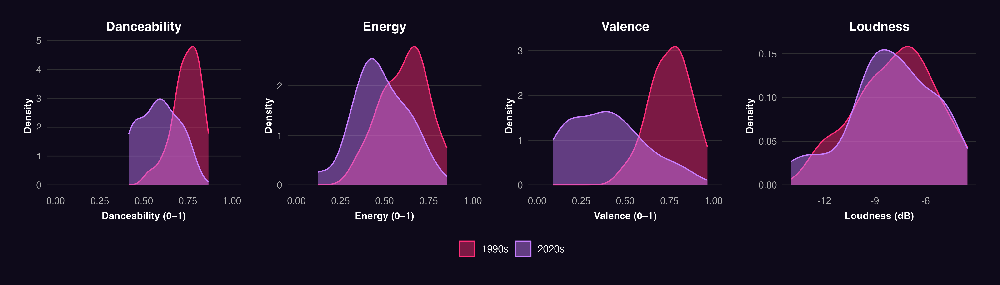
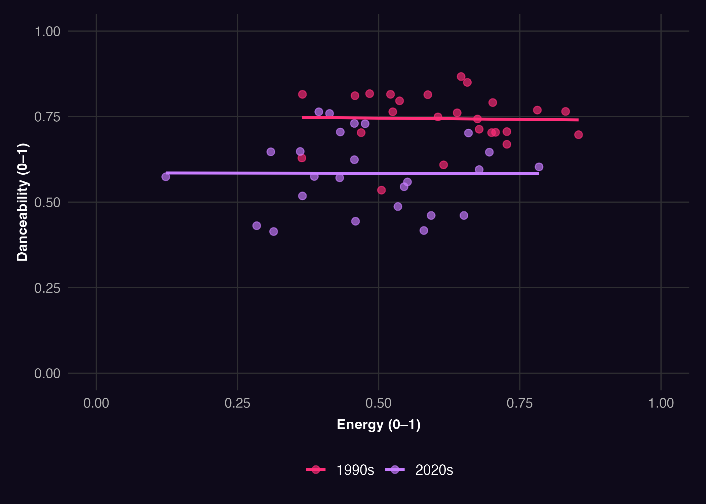
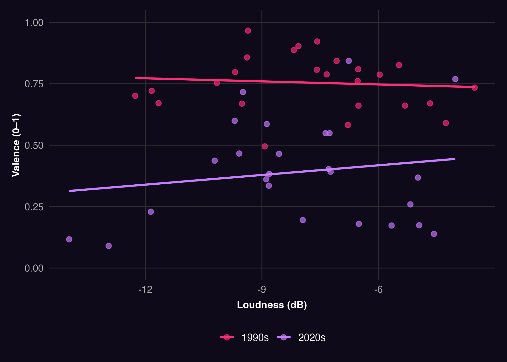
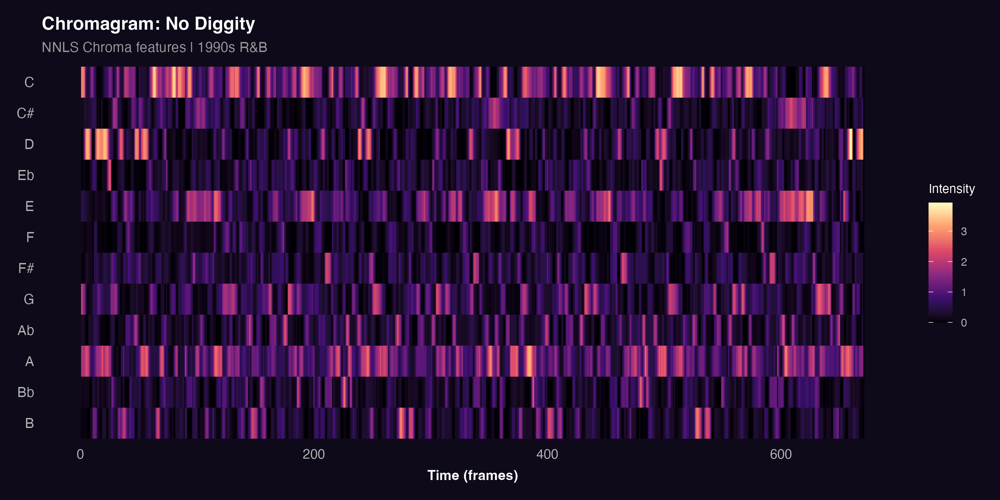
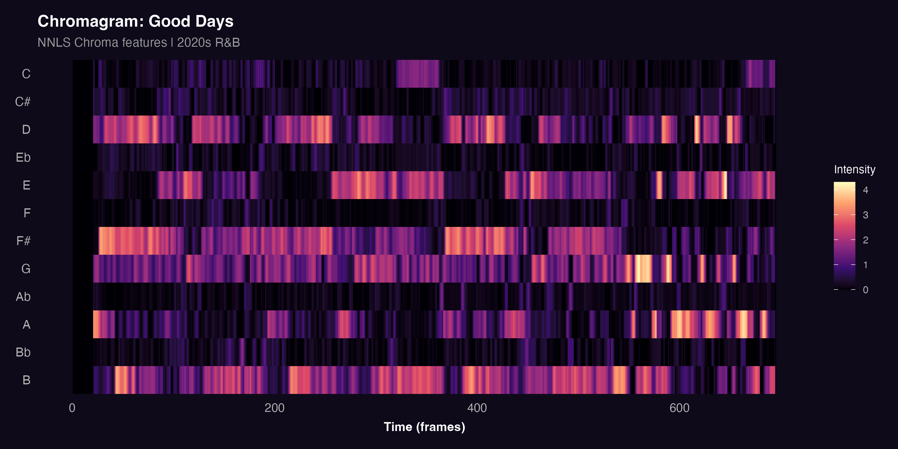

This section examines Spotify track-level features, loudness, and chroma to evaluate whether measurable differences exist between 1990s and 2020s R&B. The analysis covers **danceability, energy, valence, and loudness** at the track level, and **chroma features** at the harmonic level.

## Track-Level Features and Loudness

### Feature Distributions Across Eras

Density plots are used here because they reveal the full shape of each era's distribution, including skew, spread, and overlap — making them more informative than boxplots for identifying systematic shifts between corpora.

The 1990s corpus (pink) shows higher and more concentrated values for danceability and valence, with the danceability peak sitting around 0.75–0.80 compared to a broader, lower 2020s distribution. Valence is the most striking panel: the 1990s curve is strongly skewed toward high positivity, while the 2020s distribution shifts noticeably below 0.50, indicating more subdued and introspective emotional tones. Energy and loudness show similar but less pronounced patterns, with the 2020s corpus occupying slightly lower and more variable ranges on both dimensions.

### Relationship Between Danceability and Energy

This scatterplot examines how danceability and energy interact across eras. The 1990s corpus (pink) clusters tightly in the upper portion of the plot, with danceability consistently above 0.70 regardless of energy level indicating that high danceability was a stable property of these tracks. The 2020s corpus (purple) sits substantially lower and is more dispersed, with a weaker relationship between the two features. This decoupling suggests that in contemporary R&B, energy no longer reliably predicts danceability consistent with a shift toward a more atmospheric sound.

### Loudness and Emotional Tone

This scatterplot compares loudness with valence to examine whether sonic power and emotional positivity move together across eras. The separation is clear: the 1990s corpus (pink) clusters consistently in the upper band of the plot, with high valence at all loudness levels. The 2020s corpus (purple) sits substantially lower, with many tracks falling below 0.50 on valence. This confirms that the emotional shift in R&B is not a function of loudness 2020s tracks are more emotionally subdued across the full loudness range.

## Chroma Features

Chroma features describe the distribution of harmonic energy across the twelve pitch classes of the chromatic scale. Computed using the NNLS Chroma algorithm, they are visualised as chromagrams — heatmaps showing which pitch classes are active at each point in time. Two tracks were selected as case studies: **No Diggity** by Blackstreet (1990s) and **Good Days** by SZA (2020s), chosen as representative examples of their respective eras.

### No Diggity — Blackstreet (1990s)

The chromagram for No Diggity shows a harmonically focused and repetitive structure. Pitch classes C and A dominate consistently throughout the track, appearing as recurring bright bands with little variation over time. This reflects the track's groove-based vamp structure cycling through a small set of pitch centres without substantial harmonic development. The visual regularity of the chromagram is evidence of the loop-based, movement-oriented character of 1990s R&B.

### Good Days — SZA (2020s)

Good Days presents a markedly different harmonic profile. Harmonic energy is distributed across D, E, F#, G, A, and B, shifting between them as the track progresses. No single pitch class dominates consistently, and sections of tonal ambiguity are visible where activity is diffuse across multiple rows. This harmonic openness is consistent with the atmospheric, introspective quality of contemporary R&B.

## Key Findings

The analysis reveals a consistent pattern across all dimensions. The 1990s corpus shows higher danceability, energy, valence, and loudness features associated with physical engagement and outward emotional expression. The 2020s corpus scores lower and more variably on all four, with the gap in valence being the most pronounced.

The scatterplots reinforce this: danceability was a stable property of 1990s tracks regardless of energy level, while the two features are more weakly linked in the 2020s. The loudness versus valence plot confirms that the emotional gap between eras persists across all loudness levels.

At the harmonic level, No Diggity is built around a tight, repeating pitch class loop, while Good Days distributes its harmonic energy more freely reflecting a shift from groove-oriented repetition to atmospheric harmonic openness.

Taken together, these findings support the central research question: R&B has shifted measurably from a genre organised around danceability and rhythmic consistency toward one that prioritises mood, atmosphere, and emotional complexity.
